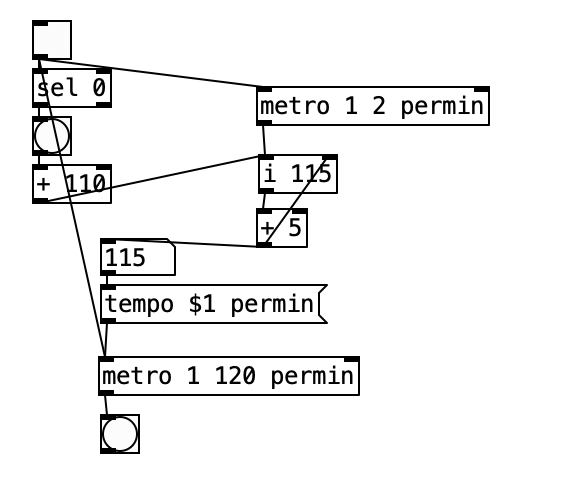
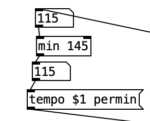
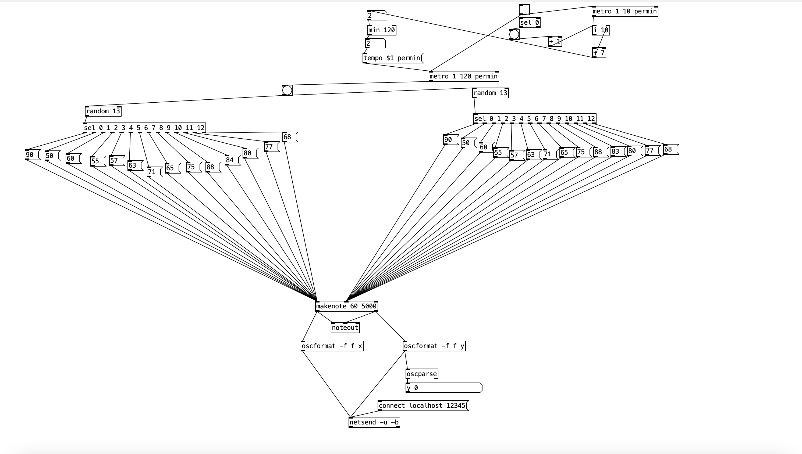

# Day 1/Final Project Report Two
[Astral Wars by Nathan Foster](https://github.com/brandedcow/OFAstralWars)

I downloaded Astral Wars to my OpenFrameworks apps folder and ran the project. It worked, so I know I can use it as a basis for my final OpenFrameworks project. The Wendy's project lacked some of the files needed to make the project, so I wasn't able to test it. That being said, I'm sure the logic is still sound, and I can reference it still if I run into any issues. 

I was planning to ask Rachel to help me with my PureData setup and ask some clarifying questions:
- Is it okay that I'm still doing a game for my project?
- How more advanced do you want the PureData portion? Is it okay if I create a simpler sequencer like the one you created for the midterm?
- Are you looking for more interactivity between the OSC messages and the game? Is enemy count and color enough? Do you have any more ideas on how to expand the use of OSC messages in this case?

I took Nathan Foster's project and added ofxOSC using the projectGenerator. I changed the project so that the LevelController file contained:

    void LevelController::update_interval(float new_interval) {
        interval_time = new_interval;
    }

I used my other projects to set up the OSC receiver in the ofApp header file and in the setup portion of the ofApp c++ file. 

I created this

    void ofApp::update() {
    while (osc_receiver.hasWaitingMessages()) {
        ofxOscMessage message;
        osc_receiver.getNextMessage(message);

    float new_interval = message.getArgAsFloat(0);
    if (new_interval > 0) {
        level_controller.update_interval(new_interval);
            }
        }
    }

to change the spawn rate. The last if is just checking whether or not the value is valid just in case things get wonky. 

I then used Rachel's PureData project to test whether or not this worked in Astral Wars, and it worked. I'm still not feeling too confident with my PureData project, but I hope I can bounce some ideas off of my classmates if they have time to take a peek. 

# Day 2
I watched two videos ([this one](https://youtu.be/8Nzaswa5C7g?si=fQ-yNHCEkt9R7S42) and [this one](https://youtu.be/eaZniOH_k3I?si=hdYJWXtnmQe06B94)) from Sound Simulator on Youtube to kickstart my understanding of PureData. Because I wasn't in class due to the LA trip, I needed some more experimentation time with Pd.  I also analyzed the last parts of Rachel's Pd project to understand how to send OSC messages to the internal server. I learned how oscformat, netsend, and oscparse and their arguments (if applicable) work. I decided to just copy and paste the system into my Pd file to make it easier. From here, I created a toggle node. Then, I created a metronome and set it to 2000ms. I then chose to create two random sequencers with 13 options each. I then attached the sequencers to the system I copied from Rachel's Pd project. I'm planning to map the spawn rate based on if the y number is above or below the value 80. 

# Day 3
Hahahahaha I added more to the PureData project. I asked Cooper for help for this system. I wanted to create a metronome that would increase tempo by 5 bpm and cap at 145 bpm to modify the spawn rate. I asked Cooper how one would accomplish this in PureData, and they said

    you could probably have a very slow metronome to be sending a message to add 5 to the number being sent to the first metronome
    im not sure how to max it out at 145 yet,

    i looked at the metro help stuff, and apparently you can just do 1 x permin, and x is equivalent to bpm

and also received this picture:

COOPER IS AWESOME. I recreated the system and added

to create the maxed out tempo. I set up a Logic session to play the PureData project and modified the numbers in the system to create the desired spawn interval. I found that my initial idea was too challenging, so this is what I settled on. 

Ignore the formatting. My brain works in mysterious ways. Now, it's time to integrate the project into the game. 

# Day 4
I learned how to code the Astral Wars today. I took the time to learn what each file and system in the game did. Here's a summary of what new things I learned:

    - #pragma once is the equivalent of #ifndef filename #define filename which prevents multiple header files of the same name from being used.
    - Bullet.cpp
        - from_player boolean to determine whether or not the player has shot a bullet
        - pos for position of bullet
        - width is equal image's width (YAY)
        - if from_player = move bullet up if it's from the player, else = move bullet downwards if it's from an enemy
    - Enemy.cpp
        - pos.x, pos.y = random horizontal position and fixed vertical position when spawned
        - amplitude = randomize movement
        - shoot_interval = randomize shoot interval
        - start_shoot = record shooting start time
        - backnforth = spinny/circular movement of enemy
        - pos.y += amplitude * cos(ofGetElapsedTimef()) = vertical movement and pos.x += amplitude * sin(ofGetElapsedTimef()) = horizontal movement 
        - time to shoot = shooting timer, is it time to shoot? shoot. not time to shoot
    - main.cpp
        - OpenGL = opens the application in a 512x768 window
        - ofRunApp = creates an application located in the bin
    - LevelController.cpp
        - edited this on day 1
    - Life.cpp
        - It does nothing? there's nothing in here
    - Player.cpp
        - Understand everything here, looks like there's nothing in the shoot method. Header file reveals that there's a boolean for checking if the player can shoot, which means that shooting may have originally come from this file rather than the the Bullet and ofApp files.
    - ofApp.cpp
        - game_state keeps track of whether you're in the main menu, game, or game over
        - limitPlayer(&player_1.pos); makes it so that the player can't leave the window
        - "if (bullets[i].pos.y - bullets[i].width/2 < 0 || bullets[i].pos.y + bullets[i].width/2 > ofGetHeight()) {bullets.erase(bullets.begin() + i);}" gets rid of off-screen bullets

I'll edit these tomorrow.

# Day 5
I changed a lot of stuff.

    #include "LevelController.hpp"

    void LevelController::setup(float s) {
        start_time = s;
        interval_time = 500;
    }

    void LevelController::processOSCInput(float value) {
        if (value > 50) {
            spawn_now = true;
        }
    }

    bool LevelController::should_spawn() {
        if (spawn_now) {
            spawn_now = false; 
            return true;       
        }
        return false; 
    }

I changed the LevelController file to make it spawn enemies only if the OSC message is above 50. I added these new methods in the correspoding header file as well. I also slowed the bullet speed by 1 (it's now s+2) to adjust for the new intervals. I also slowed the enemy to 1 instead of 3. 

Then, I moved on to working on the audio and visual assets. I had Career Workshop for Composers today, and we were reviewing demo reels. It reminded me of LinkedIn, so I created and uploaded my own visual assets with the specified game dimensions that are LinkedIn-themed. Additionally, I changed the bullet sound to the LinkedIn notfication sound. I added some intense music to the project (wav) and chose some weird ambient noise (Poprox) in Kontakt for my OSC messages. I added this to the ofApp.cpp file

    player_bullet_sound.load("player_bullet.wav");
    bgmx.load("mx-RuinsLoop-01.wav");
    bgmx.setLoop(true);
    bgmx.play();

These files didn't play when I ran the project, so I moved them into the bin without putting them in another folder within the bin. They worked after I did that. I was troubleshooting with these debug logs

    if (!bgmx.isLoaded()) {
        ofLogError() << "Failed to load mx-RuinsLoop-01.wav";
    }
    if (!player_bullet_sound.isLoaded()) {
        ofLogError() << "Failed to load player_bullet.wav";
    }

I got rid of the old OSC stuff in the ofApp file, and added "handleOSC();" to the update method to make sure the game checks for OSC messages each time it updates. I added this new "handleOSC" method.

void ofApp::handleOSC() {
    while (oscReceiver.hasWaitingMessages()) {
        ofxOscMessage m;
        oscReceiver.getNextMessage(m);

        if (m.getAddress() == "/y") {
            oscy = m.getArgAsFloat(0);
            level_controller.processOSCInput(oscy);
        }
    }}

This specifies that the y value of the OSC messages is going to determine spawn rate.

After playtesting for a bit, I got sick of closing and opening the project, so I added a reset game button. There was a reset game method already, so why not? I added this

        end_screen.draw(0,0);
        ofSetColor(255, 0, 0); 
        ofDrawRectangle(100, ofGetHeight() - 100, 200, 50); 
        ofSetColor(255);
        ofDrawBitmapString("Reset Game", 120, ofGetHeight() - 70);

to "else if (game_state == "end")" in the draw method. I added this

    if (game_state == "end") {
        if (x >= 100 && x <= 300 && y >= ofGetHeight() - 100 && y <= ofGetHeight() - 50) {
            reset_game(); 
        }
    }

to the mousePressed method. Finally, I added this

    game_state = "start";
    score = 0;
    enemies.clear();
    bullets.clear(); 
    player_1.setup(&player_image, player_start); 
    level_controller.setup(ofGetElapsedTimeMillis());   

to the reset_game method. Ta-da!